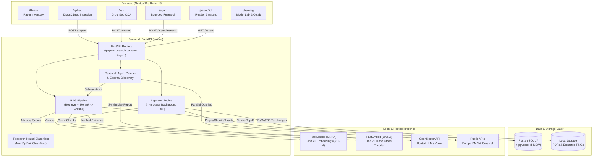
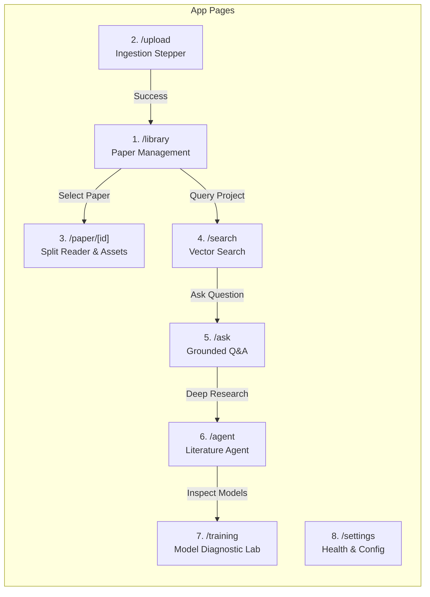
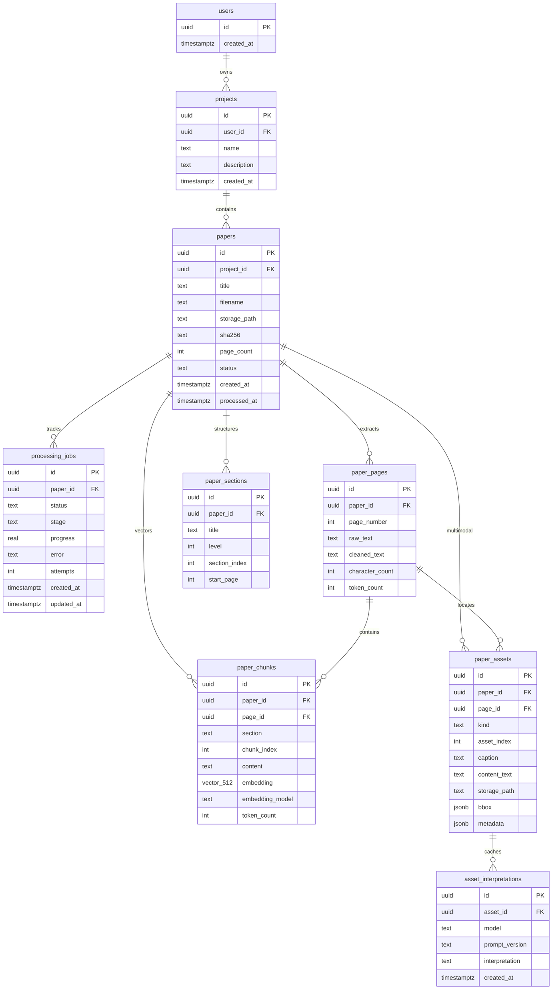
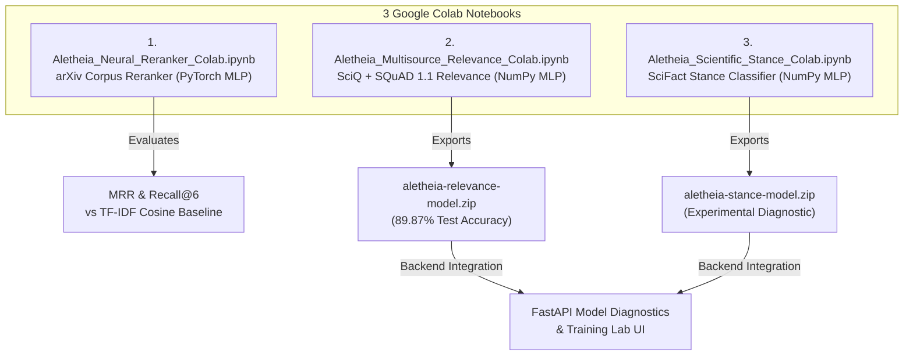
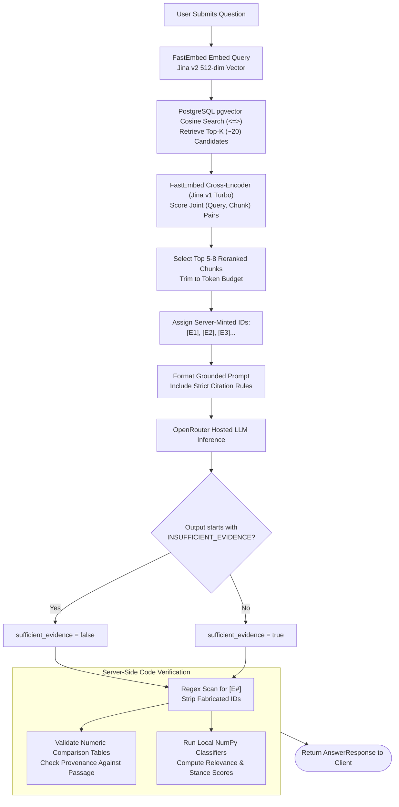
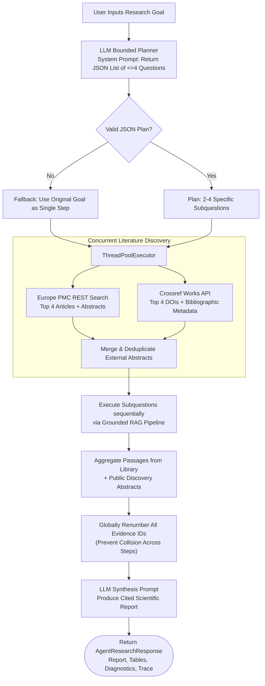

# Aletheia: Comprehensive Architectural & Technical Summary

> **Aletheia** (working title *"The Archive"*, from ancient Greek *ἀλήθεια* — truth, unconcealment) is a high-assurance scientific research intelligence platform designed to eliminate hallucinations in academic literature synthesis. It integrates multi-stage retrieval-augmented generation (RAG), local privacy-preserving embeddings and cross-encoder reranking, multimodal PDF asset extraction, bounded autonomous agent orchestration, and experimental local neural classifiers.

---

## Table of Contents
1. [Executive Overview & System Architecture](#1-executive-overview--system-architecture)
2. [App Segment: Next.js 16 Fullstack Workspace](#2-app-segment-nextjs-16-fullstack-workspace)
3. [Backend Segment: FastAPI, PostgreSQL, and RAG Pipeline](#3-backend-segment-fastapi-postgresql-and-rag-pipeline)
4. [Google Colab Segment: Deep-Learning Notebooks & Lab](#4-google-colab-segment-deep-learning-notebooks--lab)
5. [Cross-Cutting Reliability & Verification Guarantees](#5-cross-cutting-reliability--verification-guarantees)
6. [Comprehensive Flowcharts & System Graphs](#6-comprehensive-flowcharts--system-graphs)
7. [Repository File Reference Map](#7-repository-file-reference-map)

---

## 1. Executive Overview & System Architecture

### 1.1 Core Mission & The Scientific Hallucination Problem
* **The Problem**: General-purpose Large Language Models (LLMs) hallucinate citations, invent numbers, extrapolate findings, and obscure whether an assertion originates from a paper's experimental findings, an author's speculation, or general training noise.
* **The Aletheia Solution**: A high-assurance, grounded research workspace providing:
  * **Document Ingestion**: Parsing PDFs with layout, outline, tables, figures, and equations preserved.
  * **Zero-Cost Local Retrieval**: Vector search and cross-encoder reranking running locally via FastEmbed (ONNX) with zero API key requirement and zero runtime cost.
  * **Guaranteed Citation Attribution**: Server-side minted citation IDs (`[E1]`, `[E2]`). Any citation invented by the LLM is stripped by code before serialization.
  * **Transparent Fallbacks**: Explicit `INSUFFICIENT_EVIDENCE` status when literature lacks supporting data.
  * **Bounded Autonomous Agent**: Multi-hop scientific question decomposition, external literature discovery (Europe PMC & Crossref), and cited synthesis reports.
  * **Local Neural Research Classifiers**: Standalone PyTorch and NumPy deep neural networks evaluated on public benchmarks (SciQ, SQuAD 1.1, SciFact) and accessible via Google Colab.

### 1.2 Technology Stack Summary

| Layer | Technologies & Libraries | Key Responsibility |
|---|---|---|
| **Frontend UI** | Next.js 16 (App Router), React 19, TypeScript, Tailwind CSS v4 | Interactive research workspace, document reader, search, agent dashboard |
| **Typography** | Fraunces, Source Serif 4, Inter, JetBrains Mono (via `next/font/google`) | Publication-grade readability and visual hierarchy |
| **Backend API** | FastAPI, Uvicorn, Python 3.12/3.14, Pydantic v2 | REST API, async ingestion worker, grounded RAG orchestration |
| **Database & Search** | PostgreSQL 17, `pgvector` (HNSW indexing, cosine distance) | Relational metadata, page text, chunks, embeddings, assets, caching |
| **PDF Extraction** | PyMuPDF (`fitz` v1.28.2) | Font-size outline detection, raster figure extraction, table parsing, equation bounding boxes |
| **Local Models** | FastEmbed (ONNX), Jina Embeddings v2, Jina Reranker v1 Turbo | 512-dim embeddings (8K context), cross-encoder passage reranking |
| **Research ML** | NumPy, PyTorch, SciPy, Scikit-Learn | Custom relevance and stance classifiers, training scripts, loss curves |
| **Hosted LLM** | OpenRouter API (`google/gemini-2.0-flash-001` or configurable) | Grounded prose synthesis, research planning, figure interpretation |
| **External APIs** | Europe PMC REST API, Crossref Works API | Open-access external bibliographic search and abstract retrieval |

### 1.3 High-Level Architecture Flowchart



---

## 2. App Segment: Next.js 16 Fullstack Workspace

The frontend is structured as a modern Next.js 16 App Router web application with high aesthetic polish, responsive layouts, and zero client-side hallucination handling.

### 2.1 Route Architecture & Layout Structure
* **`(app)` Route Group**: Authenticated workspace layout wrapping all active views with:
  * `Sidebar.tsx`: Global navigation with active route highlights, workspace indicators, and status badges.
  * `Topbar.tsx`: Active project switcher, live API health indicator (`Live` vs `API Offline`), and breadcrumbs.
* **`(auth)` Route Group**: Clean centered layout for authentication (prepared for future auth integration).
* **Workspace Context (`lib/workspace.tsx`)**:
  * Owns the active project ID (persisted in `localStorage`).
  * Manages project list state (`projects`, `createProject`, `selectProject`).
  * **Adaptive Polling Loop**: Automatically polls `/projects/{id}/papers` every 2 seconds *only* while any document has an active processing job (`pending` or `running`). When all jobs complete or fail, the timer stops completely to avoid wasteful network traffic.
* **API Client Layer (`lib/api.ts`)**:
  * Unified type-safe fetch wrapper connecting to `NEXT_PUBLIC_API_URL` (default `http://localhost:8000`).
  * Distinguishes between **unreachable backend** (API down) and **application rejection** (validation error / 4xx/5xx). Displays contextual banners rather than misleading empty states.

### 2.2 Screen-by-Screen Functional Breakdown



#### 1. Paper Library (`/library`)
* Displays all uploaded documents in the active project.
* **Status Filter Chips**: View `All`, `Ready`, `Processing`, or `Failed` papers.
* **Real-time Status Badges**: Colored indicators displaying processing stage, page count, and upload timestamp.
* **Failure Visibility & Retry**: If ingestion fails, the exact server-side error reason is shown directly on the paper card with a single-click **Retry** button invoking `POST /papers/{id}/retry`.

#### 2. Ingestion & Upload (`/upload`)
* **Drag-and-Drop Dropzone** (`components/Dropzone.tsx`): Validates file type (`application/pdf`) and size limits.
* **Processing Stepper** (`components/ProcessingStepper.tsx`): Real-time progress bar (0% to 100%) showing the 6 discrete backend pipeline stages:
  1. `downloading` (5%) — Staging file into storage.
  2. `parsing` (20%) — PyMuPDF text & outline extraction.
  3. `extracting_assets` (35%) — Extracting raster figures, tables, and equations.
  4. `chunking` (45%) — Creating section-aware token windows.
  5. `embedding` (55%) — Local FastEmbed Jina ONNX vectorization.
  6. `persisting` (85%) — Atomic PostgreSQL transaction write.
  7. `complete` (100%) — Ready for search and Q&A.

#### 3. Distraction-Free Paper Reader (`/paper/[id]`)
* **Dual-Pane Layout**:
  * **Left Reading Pane** (`components/ReadingPane.tsx`): Paginated cleaned markdown text, font-size tuned for long-form reading, and section outline tree for instant jump navigation.
  * **Right Asset Extraction Panel** (`components/ExtractionPanel.tsx`):
    * **Figures**: Extracted high-resolution raster images with original captions and page numbers. Includes an **"Interpret Figure with AI"** button triggering OpenRouter Vision (`google/gemini-2.0-flash-001`), with cached results stored in PostgreSQL.
    * **Structured Tables**: Extracted table data rendered in clean HTML grids with captions and column headers.
    * **Equations**: Heuristically detected formula blocks with bounding box metadata and page references.

#### 4. Semantic Search (`/search`)
* Direct vector similarity search over all embedded chunks in the project.
* Query input with customizable `top_k` candidates slider (1 to 100).
* **Result Cards** (`components/SearchResultCard.tsx`): Display cosine similarity percentage, paper title, detected section name, physical page number, and text snippet.

#### 5. Grounded Q&A Workspace (`/ask`)
* Interactive scientific query interface (`components/AnswerView.tsx`).
* **Strict Citation Grounding**: Answers include clickable superscript badges `[E1]`, `[E2]` that open the exact cited evidence chunk in an inspector modal.
* **Zero Fabricated Citations**: Displays `fabricated_citations_removed` counter (must be 0).
* **Evidence Sufficiency Banner**: Clear visual distinction if the model returns `INSUFFICIENT_EVIDENCE`.
* **Inspectable Evidence Drawer**: Displays all retrieved candidate chunks, comparing raw vector cosine similarity against cross-encoder rerank logits.
* **Provenance Comparison Tables**: Conservative table parser generating structured comparative data across methods, metrics, values, units, and conditions.
* **Experimental Model Analysis Panel**: Displays local neural classifier scores (Relevance probability and Stance classification) on each query-evidence pair.

#### 6. Bounded Research Agent (`/agent`)
* Deep multi-hop literature exploration workspace for complex scientific questions.
* **Autonomous Bounded Planner**: Decomposes user goal into up to 4 specific evidence-seeking questions (with goal fallback on failure).
* **Multi-Source Discovery**: Queries Europe PMC and Crossref in parallel, pulling up to 4 public records per provider with explicit abstract labeling.
* **Grounded Sub-Answering**: Executes each subquestion against the library RAG pipeline with global citation renumbering to eliminate ID collisions.
* **Comprehensive Cited Synthesis**: Produces a structured scientific report with bold/italic Markdown, comparison tables, source coverage graphs, and model diagnostics.

#### 7. Training Lab (`/training`)
* Visual dashboard for offline and held-out machine learning models.
* **Live Performance Metrics**: Test accuracy, Macro F1, baseline comparison, and loss values for both trained neural classifiers.
* **Rendered SVG Learning Curves**: Dynamic loss curves showing training vs validation loss across epochs.
* **Confusion Matrices**: Interactive grid displaying true positive, false positive, true negative, and false negative counts.
* **Standalone Colab Downloads**: One-click download buttons for `Aletheia_Multisource_Relevance_Colab.ipynb` and `Aletheia_Scientific_Stance_Colab.ipynb`.

#### 8. Settings & Preview Pages
* `/settings`: Real-time backend health check (`/health`), PostgreSQL status, storage backend status, and active LLM configuration.
* `/claim-verification`, `/cross-paper`, `/reproducibility`: Interactive design previews displaying upcoming multi-paper consensus matrices and audit trails.

---

## 3. Backend Segment: FastAPI, PostgreSQL, and RAG Pipeline

The backend is built with FastAPI and Python 3.12+, architected around transactional integrity, local ONNX inference, and robust background task handling.

### 3.1 Architecture & Lifespan Management
* **FastAPI Lifespan (`main.py`)**:
  * Configures structured logging via `loguru`.
  * Verifies storage directory existence.
  * **Zombie Job Recovery (`recover_stranded_jobs`)**: On server startup, any job left in `running` status from an ungracefully terminated previous process is automatically transitioned to `failed` with a clear explanation, making it immediately visible and retryable.
  * Gracefully terminates PostgreSQL connection pool on shutdown (`close_pool`).
* **Database Connection Pooling (`db/session.py`)**:
  * Utilizes `psycopg-pool` (`ConnectionPool`) with `psycopg 3` binary drivers.
  * Configured with row-factory dictionaries (`dict_row`) for seamless mapping to Pydantic models.

### 3.2 Database Schema & ERD (PostgreSQL 17 + `pgvector`)



### 3.3 Core Processing Services (Deep Dive)

#### 1. Ingestion Pipeline (`services/ingestion.py`)
* Runs as a non-blocking FastAPI background task.
* Wraps all database operations in transactions so a crash leaves zero orphaned records.
* Automatically records execution errors on both `processing_jobs.error` and `papers.status = 'failed'`.
* Computes document SHA-256 hash for fast deduplication checks.

#### 2. Parsing & Outline Detection (`services/parsing.py`)
* Leverages PyMuPDF (`fitz`) to extract raw text blocks, spans, and font sizes.
* Statistical header heuristic: Analyzes font size distribution; lines with font sizes significantly above body text and matching title casing are flagged as section headers.
* Cleans non-printable characters, normalizes Unicode ligatures (fi, fl, etc.), and tracks page-level character counts.

#### 3. Multimodal Asset Extraction (`services/asset_extraction.py`)
* **Figures**: Extracts embedded raster images via PyMuPDF pixmaps; saves image binaries to `storage/papers/{id}/assets/`; associates captions by proximity heuristic.
* **Tables**: Uses PyMuPDF's table finder to detect grid lines and bounding boxes; extracts cell text into structured rows and Markdown representations.
* **Equations**: Scans for common mathematical symbols ($\sum, \int, \in, \pm, \alpha-\omega$) and font signatures; isolates formula bounding boxes.

#### 4. Section-Aware Chunking (`services/chunking.py`)
* Chunks text using a sliding window (default 400 words, 50-word overlap).
* Never crosses hard document section boundaries unless a section exceeds maximum window size.
* Carries active section title and page number forward onto every chunk.

#### 5. Embedding Provider (`services/embedding.py`)
* Model: `jinaai/jina-embeddings-v2-small-en` via `fastembed` (ONNX runtime).
* Output: 512-dimensional normalized dense vectors.
* Supports 8,192-token context window; zero API keys required; CPU/thread optimized.
* Storage: Inserted into `paper_chunks.embedding` indexed with `pgvector` HNSW (`vector_cosine_ops`).

#### 6. Semantic Candidate Retrieval (`services/retrieval.py`)
* Performs cosine distance candidate selection using the pgvector operator `<=>`:
  ```sql
  SELECT c.id AS chunk_id, c.content, c.section, pg.page_number, p.title,
         1 - (c.embedding <=> %(query_vector)s::vector) AS similarity
    FROM paper_chunks c
    JOIN papers p ON p.id = c.paper_id
    LEFT JOIN paper_pages pg ON pg.id = c.page_id
   WHERE p.project_id = %(project_id)s AND c.embedding IS NOT NULL
   ORDER BY c.embedding <=> %(query_vector)s::vector
   LIMIT %(top_k)s;
  ```
* Ensures retrieval is strictly tenant-isolated to the active `project_id`.

#### 7. Local Cross-Encoder Reranking (`services/reranking.py`)
* Model: `jinaai/jina-reranker-v1-turbo-en`.
* Why Cross-Encoder? Bi-encoders embed query and passage separately; cross-encoders process query and passage jointly through multi-head attention, drastically improving relevance judgements.
* **The 512-Token FastEmbed Bug Fix**: FastEmbed hardcodes tokenizer truncation to 512 tokens at load time. Aletheia dynamically unlocks the tokenizer via `tokenizer.enable_truncation(max_length=max_tokens)` (8,192 tokens), preventing passages from being scored on partial text.

#### 8. Grounded Answering Engine (`services/answering.py`)
* Assembles top reranked chunks into numbered `<EVIDENCE id="E1">` blocks.
* **Strict Grounding Enforcement**:
  * Code-level regex checks model output for citations (`\[E(\d+)\]`).
  * If the model cites an ID not in the provided evidence set, it is stripped immediately and tracked in `fabricated_citations_removed`.
  * If the model outputs `INSUFFICIENT_EVIDENCE`, `sufficient_evidence` is set to `false`.
* **Conservative Comparison Tables** (`services/comparison_charts.py`):
  * Parses strict comparison tables: `Method | Metric | Value | Unit | Dataset | Conditions | Evidence`.
  * Verifies every number against cited passages before rendering visual charts.

#### 9. Bounded Literature Discovery & Research Agent (`services/discovery.py`, `services/agent.py`)
* **Discovery Service**:
  * Concurrent querying of Europe PMC REST API and Crossref API with 12s timeouts.
  * Strips HTML/XML tags from abstracts; labels records as `abstract only; full text not reviewed`.
* **Planner & Synthesis**:
  * Generates structured JSON plan (`{"questions": [...]}`).
  * Fallback to raw user goal if LLM outputs invalid JSON.
  * Rewrites sub-answer citations to global IDs (`E1` to `E16`) to eliminate collisions before generating final synthesis report.

---

## 4. Google Colab Segment: Deep-Learning Notebooks & Lab

Aletheia includes three standalone, self-contained Google Colab `.ipynb` notebooks located in `/colab`. Each notebook runs end-to-end on a free CPU runtime with zero external dependencies, no required GitHub clones, and no secret keys.



---

### 4.1 Notebook 1: `Aletheia_Neural_Reranker_Colab.ipynb`
* **Title**: Aletheia — Neural Relevance Reranker
* **Generator**: `colab/build_neural_reranker_notebook.py`
* **Core Objective**: Evaluates whether a lightweight neural reranker trained on lexical and overlap signals can outperform pure TF-IDF cosine similarity on a 150-question scientific benchmark.

#### Key Components & Execution Flow:
1. **Self-Contained Benchmark**: Embeds the complete Aletheia scientific benchmark (150 questions across 10 foundational computer science papers) compressed as base64-encoded gzip JSON.
2. **Deterministic Corpus Download**: Automatically downloads 10 open-access arXiv papers and verifies each against pinned SHA-256 checksums:
   * *Attention Is All You Need* (1706.03762)
   * *Deep Residual Learning (ResNet)* (1512.03385)
   * *BERT* (1810.04805)
   * *Adam Optimizer* (1412.6980)
   * *VGG Very Deep CNNs* (1409.1556)
   * *Batch Normalization* (1502.03167)
   * *Retrieval-Augmented Generation (RAG)* (2005.11401)
   * *Language Models are Few-Shot Learners (GPT-3)* (2005.14165)
   * *Word2Vec (Distributed Representations)* (1301.3781)
   * *Generative Adversarial Nets (GAN)* (1406.2661)
3. **Extraction & Chunking**: Uses PyMuPDF to extract text and build page-aware chunks (300 words, 40-word overlap).
4. **Candidate Generation & Feature Engineering**: Generates top 20 candidate chunks per question via TF-IDF cosine similarity. Computes 5 dense features:
   * $f_1$: TF-IDF Cosine Similarity score.
   * $f_2$: Word-token Jaccard similarity.
   * $f_3$: Numeric token coverage (fraction of numbers in query present in passage).
   * $f_4$: Section heading token overlap.
   * $f_5$: Log-scaled passage length ($\log(1 + |tokens|) / 10$).
5. **Leakage-Free Question Split**: Splits dataset 80/20 by deterministic question hash (`SHA-256(question_id) % 5 == 0`), ensuring no passage from a validation question appears during training.
6. **PyTorch MLP Architecture**:
   * Input: 5 features $\to$ Linear(5, 16) $\to$ ReLU $\to$ Linear(16, 8) $\to$ ReLU $\to$ Linear(8, 1) $\to$ Sigmoid.
   * Loss: `BCEWithLogitsLoss` with positive class weighting.
   * Optimizer: Adam ($\text{lr}=0.01$, weight decay $1e-4$, gradient clipping at 5.0).
7. **Measured Evaluation**: Evaluates Mean Reciprocal Rank (MRR) and Recall@6, measuring ranking quality gains over baseline.

---

### 4.2 Notebook 2: `Aletheia_Multisource_Relevance_Colab.ipynb`
* **Title**: Aletheia — Multi-source Evidence Relevance
* **Generator**: `colab/build_research_notebooks.py` (`task='relevance'`)
* **Core Objective**: Trains a portable, zero-dependency neural network to predict whether a candidate passage directly supports answering a research question, learning across distinct biomedical and general QA datasets.

#### Key Components & Execution Flow:
1. **Public Datasets & Licenses**:
   * **SciQ** (Allen Institute for AI): 13,679 science exam questions with supporting passages (CC BY-NC 3.0).
   * **SQuAD 1.1** (Stanford University): High-quality reading comprehension query-passage pairs (CC BY-SA 4.0).
2. **Data Curation & Sampling**:
   * Downloads raw archives, verifies SHA-256 hashes, and samples up to 6,000 questions per dataset.
   * **Connected Component Splitting**: Groups shared queries and documents into connected clusters, assigning clusters deterministically to **70% Train, 15% Validation, 15% Test**.
   * Hard assertion: Zero overlap of normalized questions or passages across splits.
   * **Hard Negative Mining**: Weak negatives sampled from different documents within the same split having high lexical overlap but lacking the literal answer.
   * Dataset Volume: **23,988 total pairs** (16,515 train, 3,651 validation, 3,822 test).
3. **516-Dimensional Feature Representation**:
   * 128-dim normalized hashed-word vectors using Blake2b hash bucketing with alternating signs.
   * Query vector $q \in \mathbb{R}^{128}$, Passage vector $p \in \mathbb{R}^{128}$.
   * Concatenated interaction vector: $[q, p, |q - p|, q \odot p] \in \mathbb{R}^{512}$.
   * 4 scalar overlap signals: query token overlap ratio, Jaccard overlap, vector dot product, normalized passage length. Total input dimension = **516**.
4. **NumPy Deep MLP Architecture**:
   * Layer 1: $516 \to 96$ (He normal initialization, ReLU activation).
   * Layer 2: $96 \to 32$ (He normal initialization, ReLU activation).
   * Layer 3: $32 \to 2$ (Softmax output: `[non_relevant, relevant]`).
   * Implemented in pure NumPy with backpropagation, Adam optimizer, balanced class weights, L2 regularization ($1e-4$), gradient clipping ([-5, 5]), and early stopping on validation macro F1.
5. **Measured Results**:
   * **Test Accuracy**: **89.87%** (vs **84.96%** lexical baseline).
   * **Test Macro F1**: **0.8987** (Baseline: 0.8488).
   * SciQ Test F1: **0.9371**; SQuAD Test F1: **0.8640**.
   * Log Loss: **0.2514**.
6. **Model Export**: Generates `aletheia-relevance-model.zip` containing `weights.npz` (pickle disabled), `model.json`, `training.svg`, and `sources.json`. Ready to drop into `backend/models/research/relevance/`.

---

### 4.3 Notebook 3: `Aletheia_Scientific_Stance_Colab.ipynb`
* **Title**: Aletheia — Scientific Claim Stance
* **Generator**: `colab/build_research_notebooks.py` (`task='stance'`)
* **Core Objective**: Evaluates a neural classifier's ability to detect whether an academic abstract **supports** or **contradicts** a declarative scientific claim.

#### Key Components & Execution Flow:
1. **Public Dataset**:
   * **SciFact** (Allen Institute for AI): Expert-annotated scientific claims paired with research abstracts labeled as `SUPPORTS` or `CONTRADICTS` (Claims CC BY 4.0, Abstracts ODC-By 1.0).
2. **Data Curation & Partitioning**:
   * 771 total pairs (554 train, 117 validation, 100 test).
   * Connected component partitioning ensures shared claims and documents never cross splits.
3. **516-Dimensional Feature Space**:
   * Reuses the 516-dim hashed pair interaction and lexical overlap contract.
4. **NumPy Deep MLP Architecture**:
   * Architecture: $516 \to 128 \to 48 \to 2$ (Softmax output: `[contradicts, supports]`).
   * Optimized with Adam, class weighting, and early stopping.
5. **Measured Results & Transparent Scientific Limitations**:
   * **Test Accuracy**: **54.00%** (vs **63.00%** majority class baseline).
   * **Test Macro F1**: **0.4715** (Validation Macro F1 was 0.6154, revealing test generalization drop).
   * Contradiction Class F1: **0.2813**; Support Class F1: **0.6618**.
   * Log Loss: **0.9866**.
6. **Architectural Role**:
   * The platform honestly reports these limitations in the UI and documentation.
   * The model serves as an **experimental diagnostic indicator** in the UI, never as an automated scientific verdict or LLM override.
7. **Model Export**: Bundles `weights.npz` and `model.json` into `aletheia-stance-model.zip`.

---

### 4.4 Comprehensive Comparison of the 3 Colab Notebooks

| Metric / Attribute | Notebook 1: Neural Reranker | Notebook 2: Multi-Source Relevance | Notebook 3: Scientific Stance |
|---|---|---|---|
| **Filename** | `Aletheia_Neural_Reranker_Colab.ipynb` | `Aletheia_Multisource_Relevance_Colab.ipynb` | `Aletheia_Scientific_Stance_Colab.ipynb` |
| **Core Task** | Ranking retrieved arXiv chunks | Predicting query-passage relevance | Classifying claim support vs contradiction |
| **Data Sources** | 10 pinned arXiv PDFs + 150 benchmark Qs | SciQ (Ai2) + SQuAD 1.1 (Stanford) | SciFact (Ai2) |
| **Sample Size** | ~2,500 candidate pairs | 23,988 pairs (70/15/15 split) | 771 pairs (70/15/15 split) |
| **Input Features** | 5 dense lexical/overlap features | 516-dim hashed-word pair interactions | 516-dim hashed-word pair interactions |
| **Network Architecture** | 5 $\to$ 16 $\to$ 8 $\to$ 1 (PyTorch) | 516 $\to$ 96 $\to$ 32 $\to$ 2 (NumPy) | 516 $\to$ 128 $\to$ 48 $\to$ 2 (NumPy) |
| **Optimizer / Loss** | Adam / Weighted BCEWithLogits | Adam / Weighted Cross-Entropy | Adam / Weighted Cross-Entropy |
| **Measured Metric** | MRR & Recall@6 vs Cosine | **89.87% Accuracy** / **0.8987 Macro F1** | **54.00% Accuracy** / **0.4715 Macro F1** |
| **Baseline Performance** | TF-IDF Cosine Similarity | 84.96% Accuracy (Lexical threshold) | 63.00% Accuracy (Majority class) |
| **Runtime Requirement** | Python 3 + PyTorch + PyMuPDF | Python 3 + NumPy (Zero external libs) | Python 3 + NumPy (Zero external libs) |
| **System Role** | Offline benchmark evaluation | Live advisory diagnostic in `/ask` | Live advisory diagnostic in `/ask` |

---

## 5. Cross-Cutting Reliability & Verification Guarantees

Aletheia implements strict software engineering protocols to ensure academic rigor and operational reliability:

### 5.1 The Zero-Fabrication Citation Protocol
* In traditional RAG, LLMs regularly hallucinate citation markers like `[1]` or `[Smith et al.]`.
* In Aletheia, the backend dynamically mints evidence tags (`E1`, `E2`, ...).
* Before serializing any answer, the backend executes regex validation:
  $$\text{Valid Citations} = \text{Extracted IDs} \cap \text{Provided Evidence IDs}$$
* Any invented citation is removed from the text, and `fabricated_citations_removed` is incremented. The frontend surfaces this metric directly.

### 5.2 The Explicit Insufficiency Protocol
* If the retrieved evidence does not contain sufficient factual data to answer a query, the system prompt instructs the model to return `INSUFFICIENT_EVIDENCE` as its first line.
* The API serializes this as `sufficient_evidence = false`.
* The frontend renders this state with a distinct amber alert banner rather than treating it as an empty state or a server crash.

### 5.3 Output Truncation & Token Budgeting
* If the LLM reaches provider token limits (`finish_reason = "length"`), the backend flags `truncated = true`.
* The frontend displays a **"Partial response — output limit reached"** notification, preventing partial or truncated text from masquerading as a complete answer.

### 5.4 Leakage-Free Machine Learning Splits
* To prevent benchmark leakage, all training scripts use connected-component document clustering.
* Normalization guarantees that questions and passages in the test set are completely absent from training and validation sets.

---

## 6. Comprehensive Flowcharts & System Graphs

### 6.1 End-to-End Ingestion Lifecycle Flowchart

```mermaid
flowchart TD
    Start([User Drops PDF]) --> Upload[POST /projects/{id}/papers]
    Upload --> SaveFile[Write File to Disk\nCompute SHA-256]
    SaveFile --> CreateJob[Create processing_jobs Row\nStatus = pending]
    CreateJob --> BGTask[Launch Ingestion Background Task]

    subgraph IngestionTask["In-Process Background Task (services/ingestion.py)"]
        Stage1["1. downloading (5%)\nVerify local file storage"] --> Stage2["2. parsing (20%)\nPyMuPDF text & outline extraction"]
        Stage2 --> Stage3["3. extracting_assets (35%)\nExtract figures, tables, equations"]
        Stage3 --> Stage4["4. chunking (45%)\nSection-aware sliding token windows"]
        Stage4 --> Stage5["5. embedding (55%)\nFastEmbed Jina ONNX batched vectors"]
        Stage5 --> Stage6["6. persisting (85%)\nSingle PostgreSQL transaction write"]
        Stage6 --> Stage7["7. complete (100%)\nStatus = succeeded, paper = ready"]
    end

    BGTask --> IngestionTask
    IngestionTask -->|On Any Exception| FailJob["Catch Exception\nWrite error to DB\nStatus = failed"]
    FailJob --> RetryOption([User Clicks Retry])
    RetryOption --> Upload
```

### 6.2 Grounded Retrieval-Augmented Generation (RAG) Flowchart



### 6.3 Autonomous Research Agent Execution Flowchart



---

## 7. Repository File Reference Map

```
Aletheia/
├── app/                                  # Next.js 16 App Router Frontend
│   ├── (app)/                            # Authenticated workspace chrome layout
│   │   ├── agent/page.tsx                # Autonomous Research Agent interface
│   │   ├── ask/page.tsx                  # Grounded Q&A workspace with citations
│   │   ├── claim-verification/page.tsx   # Claim verification preview workspace
│   │   ├── cross-paper/page.tsx          # Cross-paper consensus matrix preview
│   │   ├── library/page.tsx              # Paper library with status polling
│   │   ├── paper/[id]/page.tsx           # Distraction-free reader + asset viewer
│   │   ├── reproducibility/page.tsx      # Reproducibility audit checklist preview
│   │   ├── search/page.tsx               # Semantic vector search view
│   │   ├── settings/page.tsx             # System health & provider status
│   │   ├── training/page.tsx             # Training Lab metrics, curves & downloads
│   │   └── upload/page.tsx               # Multi-stage PDF upload stepper
│   ├── api/training/[task]/route.ts      # Colab notebook download API endpoint
│   ├── layout.tsx                        # Global root HTML & typography configuration
│   └── globals.css                       # Tailwind CSS v4 design tokens & theme vars
├── components/                           # Reusable UI component library (28 files)
│   ├── AnswerView.tsx                    # Grounded answer rendering, citations, drawers
│   ├── Dropzone.tsx                      # Drag-and-drop PDF upload component
│   ├── ExtractionPanel.tsx               # Figures, tables, and equations panel
│   ├── PaperReader.tsx                   # Full paper reading pane with outline
│   ├── ProcessingStepper.tsx             # 6-stage ingestion progress indicator
│   ├── ProjectSwitcher.tsx               # Project selection dropdown
│   └── Sidebar.tsx / Topbar.tsx          # Workspace navigation frame
├── lib/                                  # Frontend utility and state management
│   ├── api.ts                            # Typed backend API client & error handler
│   ├── display.ts                        # Shared formatting (scores, stages, dates)
│   ├── preview-data.ts                   # Preview fixtures for un-wired features
│   └── workspace.tsx                     # Active project React Context & paper polling
├── backend/                              # FastAPI Service & ML Lab
│   ├── apps/api/
│   │   ├── main.py                       # FastAPI application & lifespan management
│   │   ├── app/
│   │   │   ├── api/                      # REST API Routers
│   │   │   │   ├── agent.py              # POST /projects/{id}/agent/research
│   │   │   │   ├── answer.py             # POST /projects/{id}/answer
│   │   │   │   ├── assets.py             # GET /assets, figure interpretation
│   │   │   │   ├── health.py             # GET /health
│   │   │   │   ├── papers.py             # Paper CRUD, upload, retry
│   │   │   │   ├── projects.py           # Project CRUD
│   │   │   │   └── search.py             # POST /projects/{id}/search
│   │   │   ├── db/session.py             # Psycopg 3 connection pooling
│   │   │   ├── schemas/models.py         # Pydantic schemas (wire contract)
│   │   │   └── services/                 # Core business & algorithmic services
│   │   │       ├── agent.py              # Bounded research planner & synthesis
│   │   │       ├── answering.py          # Grounded answering & citation checking
│   │   │       ├── asset_extraction.py   # PyMuPDF figures, tables, equations
│   │   │       ├── chunking.py           # Section-aware token windowing
│   │   │       ├── comparison_charts.py  # Conservative tabular provenance check
│   │   │       ├── discovery.py          # Europe PMC & Crossref API client
│   │   │       ├── embedding.py          # FastEmbed ONNX Jina v2 embedding
│   │   │       ├── figure_interpretation # OpenRouter Vision interpretation
│   │   │       ├── ingestion.py          # 6-stage background ingestion pipeline
│   │   │       ├── parsing.py            # PyMuPDF text & font outline parser
│   │   │       ├── reranking.py          # FastEmbed Cross-Encoder (cap lifted)
│   │   │       ├── research_models.py    # NumPy neural pair-classifiers
│   │   │       └── retrieval.py          # pgvector cosine candidate retrieval
│   │   └── migrations/                   # SQL migration scripts (0001 - 0006)
│   ├── datasets/research/                # Public research data (SciQ, SQuAD, SciFact)
│   ├── docs/research-models.md           # Model methodology, benchmarks & licenses
│   ├── models/research/                  # Saved model weights (.npz) & metadata
│   └── scripts/
│       ├── prepare_research_data.py      # Download & clean public datasets
│       └── train_research_models.py      # Train NumPy MLPs & generate SVG loss curves
├── colab/                                # Google Colab Deep Learning Lab
│   ├── Aletheia_Multisource_Relevance_Colab.ipynb # SciQ + SQuAD relevance notebook
│   ├── Aletheia_Neural_Reranker_Colab.ipynb       # arXiv 10-paper reranker notebook
│   ├── Aletheia_Scientific_Stance_Colab.ipynb     # SciFact stance classifier notebook
│   ├── build_neural_reranker_notebook.py          # Rebuilds arXiv reranker notebook
│   ├── build_research_notebooks.py                # Rebuilds relevance & stance notebooks
│   ├── validate_research_notebooks.py             # Validates notebook execution
│   └── validation-results.json                    # Execution verification logs
└── README.md                             # Repository setup & execution guide
```
