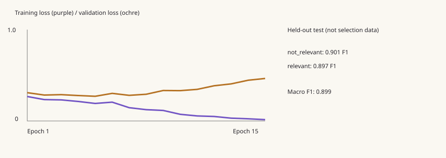
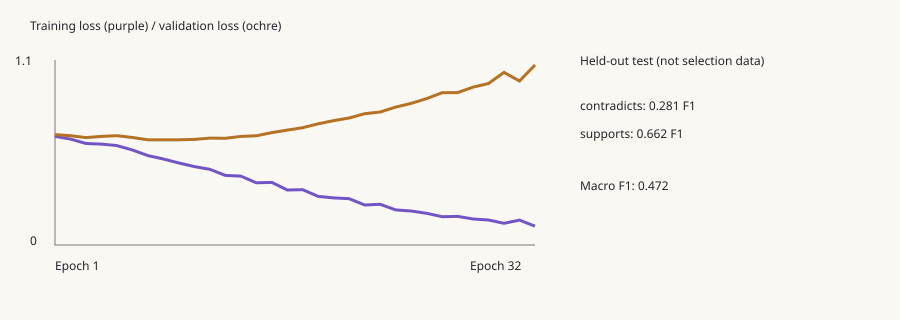

# Research training and agent upgrade

Three public datasets were downloaded and **two new text-pair neural networks were trained locally**. Both are integrated into the answer API's `model_diagnostics` and the chat's expandable **Experimental model analysis** panel. They do not replace the production Jina cross-encoder, decide truth, or fine-tune the hosted chat language model.

## Reproduce

From the repository root, using the existing backend environment:

```sh
backend/.venv/bin/python backend/scripts/prepare_research_data.py
OPENBLAS_NUM_THREADS=1 VECLIB_MAXIMUM_THREADS=1 backend/.venv/bin/python backend/scripts/train_research_models.py
backend/.venv/bin/python -m pytest backend/tests -q
```

The collector downloads about 36 MB, retries failed requests, reads archives without extracting arbitrary paths, caches snapshots, and records source URLs, attribution, sizes and SHA-256 checksums in `backend/datasets/research/sources.json`. A changed upstream checksum requires a fresh output directory so the dataset change is explicit. It does not run source-provided code. Generated JSONL pairs and raw archives remain local and are reproducible; model artifacts and reports are small enough to retain.

## Data and evaluation design

| Dataset | Use | Source / terms |
|---|---|---|
| SciQ | Question/support pairs for relevance | [Ai2 dataset card](https://huggingface.co/datasets/allenai/sciq), CC BY-NC 3.0 |
| SQuAD 1.1 | Question/passage pairs for relevance | [Stanford dataset](https://rajpurkar.github.io/SQuAD-explorer/), CC BY-SA 4.0 |
| SciFact | Annotated support/contradiction abstract pairs | [Ai2 license](https://github.com/allenai/scifact/blob/master/LICENSE.md), claims CC BY 4.0, abstracts ODC-By 1.0 |

Retain attribution and check dataset/model redistribution terms, especially SciQ's noncommercial restriction. Downloading a dataset does not remove its license conditions.

QA sampling uses stable hashes, capped at 6,000 questions per dataset. Exact duplicate query/passage pairs collapse. Connected components of shared documents and normalized questions receive a deterministic 70/15/15 split. SQuAD groups by article; SciFact groups shared claims and abstract documents. Official SciFact train/dev are regrouped; these are **not official benchmark/leaderboard results**. Every training run checks that normalized questions and passages are disjoint between splits, and that both labels are present in every split.

Relevance negatives use a different passage from the same source and split, selected for lexical overlap among a bounded candidate pool, excluding passages containing the literal answer. These are **weak labels**, not human-certified negatives. They can still be false negatives. There is no transfer from the project's existing benchmark into these training tasks.

| Task | Training pairs | Validation pairs | Test pairs | Total |
|---|---:|---:|---:|---:|
| Relevance | 16,515 | 3,651 | 3,822 | 23,988 |
| Stance | 554 | 117 | 100 | 771 |

## Measured results

| Model | Architecture | Test accuracy | Test macro F1 | Baseline accuracy | Baseline macro F1 |
|---|---|---:|---:|---:|---:|
| Relevance | 516 → 96 → 32 → 2 | 89.87% | 0.8987 | 84.96% | 0.8488 |
| Scientific stance | 516 → 128 → 48 → 2 | 54.00% | 0.4715 | 63.00% | 0.3865 |

The relevance baseline is a query-word-coverage threshold selected on validation only. The stance baseline predicts the training majority class. Relevance test macro F1 is **0.9371 on SciQ** and **0.8640 on SQuAD**. This difference indicates that performance depends on the data source, not just aggregate sample count.

Stance validation macro F1 was 0.6154, falling to 0.4715 on the small held-out test set. Contradiction F1 was only 0.2813. Its slightly higher macro F1 than a majority baseline does **not** offset the poor accuracy or establish reliable verification. It stays experimental and never overrides the LLM or citations. Questions are not declarative claims, so stance scores on a research question are not interpretable as verdicts. The model has no neutral/unknown class.

Both networks use fixed normalized hashed-word features, query/passage differences, pair products and four overlap/length signals. Hidden layers learn through backpropagation with Adam, weighted cross-entropy, L2 regularization and gradient clipping. Early stopping selects validation macro F1, not test performance. Word order, compositional meaning and negation are not well represented. Scores are uncalibrated. No production Jina comparison, blinded answer-quality study, or scientific-validity guarantee is claimed.





The artifacts include weights, feature version, checksums, class counts, source-specific metrics, confusion matrices, epoch history and per-example held-out predictions. Serialization uses numeric NPZ arrays with `allow_pickle=False`; a load/save inference-equivalence check runs at the end of training.

## Colab notebooks

- `colab/Aletheia_Multisource_Relevance_Colab.ipynb`
- `colab/Aletheia_Scientific_Stance_Colab.ipynb`

Both are standalone: upload/open in Colab, select a Python CPU runtime and **Run all**. Each embeds the exact data preparation, training and inference modules, downloads the public data, trains its own architecture, displays evaluation/graphs, tests inference and exports a ZIP. No GitHub URL or training secret is needed. Unzip the artifact inside `backend/` and restart the API. Both notebooks have been executed locally through every code cell, including training and export; **a hosted Google Colab run has not been performed**. Execution records are in `colab/validation-results.json` and the notebook outputs. Regenerate with `colab/build_research_notebooks.py`; validate with `colab/validate_research_notebooks.py` after downloading the datasets.

## Runtime integration

```dotenv
RESEARCH_MODELS_ENABLED=true
RESEARCH_MODELS_DIR=models/research
LLM_MAX_OUTPUT_TOKENS=2048
```

Paths are relative to `backend/`. Missing or corrupt artifacts surface as unavailable diagnostics without breaking answers. Restart the API after replacing artifacts, as model instances are cached. Local training and inference require NumPy, already present in the backend requirements. Changing hidden-layer architecture requires compatible weight shapes; changing features requires a new feature version.

The **Training Lab** sidebar page displays bundled model metrics, learning curves and confusion matrices, with allowlisted notebook downloads. It reflects the model artifacts at frontend build time; rebuild the frontend after retraining to refresh this dashboard.

The Research Agent interface now enables `synthesize` and `discover_sources` on the existing endpoint. API clients may omit both flags to preserve the earlier plan/answer behavior. Each run:

1. Plans at most four evidence-seeking subquestions.
2. Searches Europe PMC and Crossref, up to four records per provider, with bounded timeouts and per-provider error reporting.
3. Answers subquestions using the project's existing retrieval/reranking pipeline.
4. Combines raw library passages and available public abstracts under the existing token budget. Abstracts are explicitly labeled; metadata-only discoveries cannot become answer evidence. Step citation IDs are reissued globally so `E1` from two different steps never collides.
5. Produces a cited report covering results, methods, limitations, disagreements and open questions. Both experimental classifiers analyze the original user goal against the evidence, separately from synthesis instructions.
6. Renders Markdown headings, **bold**, *italics*, lists, tables, clickable citations, source coverage bars, and model diagnostics. HTML and remote Markdown images are disabled; only server-resolved source links are clickable.

Numerical comparison charts require the exact table columns `Method | Metric | Value | Unit | Dataset | Conditions | Evidence`. Every plotted number and its labels must appear in a cited passage; rows must share metric/unit/dataset/conditions. Unsupported, incomplete or incompatible rows are not plotted. This is conservative literal provenance checking, not a guarantee of semantic equivalence. The original table and source links remain available. Evidence coverage bars count passages, not confidence.

Empty, uncited, fabricated-citation, or output-truncated answers are not marked sufficient. A provider `finish_reason=length` is preserved into the API and shown as **Partial response — output limit reached**. Individual research steps remain available if the final synthesis fails. The hosted provider still needs a working key and enough credits; no credits were purchased or account settings changed.

## Verification

- Full backend suite: 235 tests passed after the chart/truncation additions. The final extended endpoint check is recorded in `validation-summary.json`.
- Both notebooks: all six Python cells executed, including fresh training, graph output, inference and ZIP export.
- Real Europe PMC and Crossref calls succeeded, returning public records and abstracts.
- A live browser research run used the configured OpenRouter model, returned a cited public-evidence synthesis and displayed both classifier tables. Citation controls were exercised. A smaller output budget was necessary due to limited existing provider credits; the run exposed truncation, which now has explicit handling and regression tests.
- Frontend: TypeScript, ESLint and a production Webpack build. Default Turbopack encountered an environment worker-socket restriction; Webpack compiled successfully.
